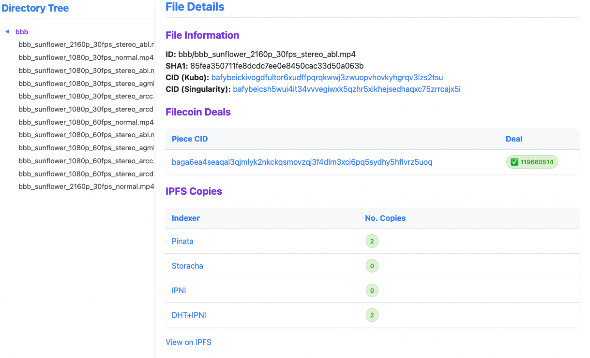
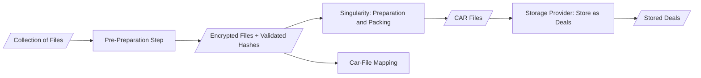

# CAR Content Locator

Originally developed for USC (University of Southern California) Libraries to keep track of private files stored on the Filecoin network and explore Deal information, the CAR Content Locator now supports:

- Storing file metadata
- Storing file location within a Piece and Deal information on the Filecoin network (requires Singularity)
- Looking up copies of a file on IPFS using public/private delegated routing endpoints

## Screenshot



## Installation

### Prerequisites

- LAMP stack (Linux, Apache, MySQL, PHP) or equivalent server environment
- Singularity CLI tool installed and configured using MySQL
- MySQL/MariaDB database server
- PHP 7.4 or higher

### Setup

1. Clone or download the CAR Content Locator files to your web server directory
1. Create a `_config.php` file in the root directory with the following content:
   ```php
    <?php
    $sql_dbname = "[[ DBNAME ]]";       // Your database name
    $sql_username = "[[ USERNAME ]]";   // Database username
    $sql_password = "[[ PASSWORD ]]";   // Database password
    $sql_servername = "[[ HOSTNAME ]]"; // Database hostname (localhost or IP)
   ```
1. Initialize the Singularity database using the admin command:  
    `singularity admin init`
1. Create the additional required database tables (see SQL section below)
1. Navigate to the application URL in your web browser to verify the installation

## Database Schema

The application requires the following additional tables beyond the standard Singularity schema.

### Data Table

Tracks metadata for files in the dataset:
```sql
CREATE TABLE `usc_data` (
  `usc_data_id` int(11) NOT NULL AUTO_INCREMENT,
  `file_path` varchar(1000) NOT NULL,
  `sha1` varchar(100) NOT NULL,
  `title_id` varchar(50) NOT NULL,
  `file_id` int(11) NOT NULL,
  PRIMARY KEY (`usc_data_id`),
  KEY `index_file_path` (`file_path`(768)),
  KEY `usc_data_title_id` (`title_id`)
) ENGINE=InnoDB AUTO_INCREMENT=1224999 DEFAULT CHARSET=utf8mb4 COLLATE=utf8mb4_general_ci;
```

### Files Table

Stores details about files:
```sql
CREATE TABLE `usc_files` (
  `id` int(11) NOT NULL AUTO_INCREMENT,
  `relative_path` text DEFAULT NULL,
  `sha1` text DEFAULT NULL,
  `size` bigint(11) DEFAULT NULL,
  `key_fp` text DEFAULT NULL,
  `encrypted_key` text DEFAULT NULL,
  `title_id` varchar(50) NOT NULL DEFAULT '',
  `usc_file_id` int(11) NOT NULL,
  `tar_source` int(11) NOT NULL DEFAULT 0,
  PRIMARY KEY (`id`),
  KEY `index_relative_path` (`relative_path`(768)),
  KEY `files_title_id` (`title_id`)
) ENGINE=InnoDB AUTO_INCREMENT=1284775 DEFAULT CHARSET=utf8mb4 COLLATE=utf8mb4_general_ci;
```

### File Range CAR Table

Maps file ranges to CAR files:
```sql
CREATE TABLE `file_range_car` (
  `file_range_id` int(11) DEFAULT NULL,
  `car_id` int(11) DEFAULT NULL,
  KEY `idx_file_range_car_file_range_id` (`file_range_id`),
  KEY `idx_file_range_car_car_id` (`car_id`)
) ENGINE=InnoDB DEFAULT CHARSET=utf8mb4 COLLATE=utf8mb4_unicode_ci;
```

## Usage in the USC Libraries' Filecoin Pipeline

USC Libraries uses the following Singularity-based pipeline to prepare encrypted data for storing onto their Filecoin node, as well as nodes of their storage partners.
The CAR Content Locator relies on data produced at various steps to keep track of file metadata, file ranges, Piece CIDs, and Deal information.



_* Data archived by USC Libraries is generally not publicly accessible, and not published to IPFS, so the IPFS features are not used by USC Libraries_
